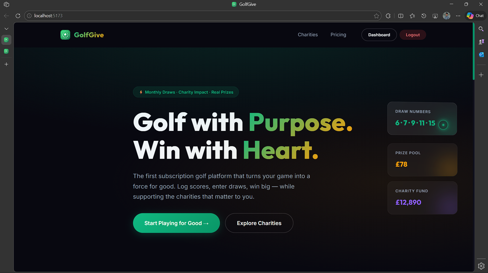
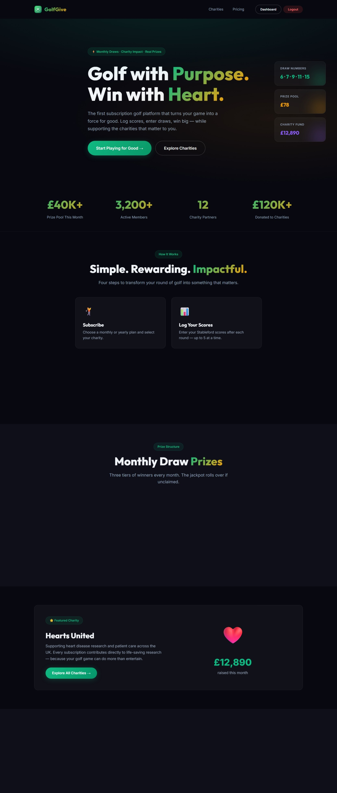
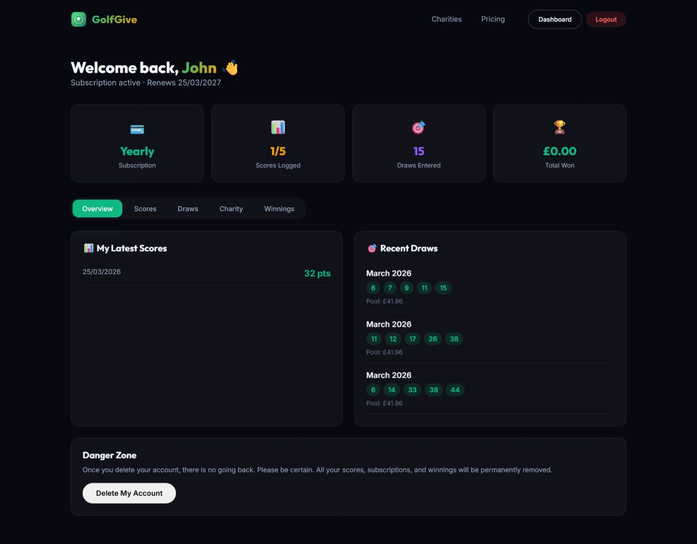
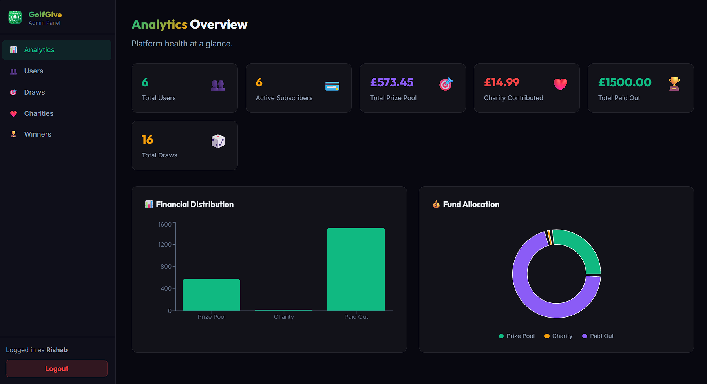
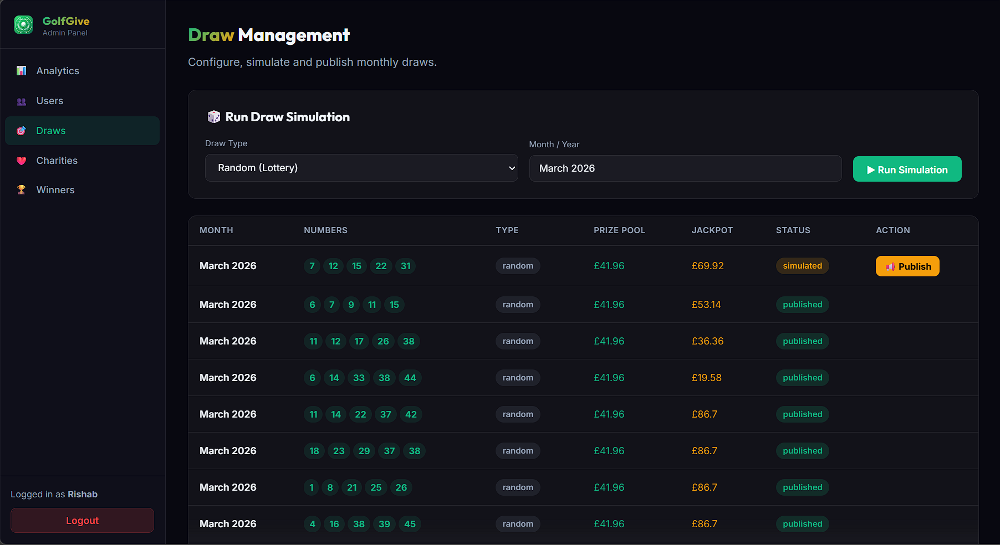

# ⛳ GolfGive - Full Stack Development Project
### Internship Portfolio Project



---

## 📌 Project Summary

**GolfGive** is a full-stack web application built during my internship. It's a subscription-based golf platform that combines:
- Monthly prize draws for golfers
- Automatic score tracking
- Charitable giving integration
- Admin management system

**Duration:** [Start Date] - [End Date]  
**Tech Stack:** React, Node.js, Supabase, Express, Razorpay

---

## 🎯 Project Goals

- Build a production-ready full-stack application
- Implement real-time data synchronization
- Integrate third-party payment processing
- Design responsive user interfaces
- Develop admin dashboard for management
- Deploy across multiple environments

---

## ✨ Key Features Implemented

### Frontend (React + Vite)
✅ **User Authentication**
- Registration & login with JWT
- Secure token storage
- Protected routes

✅ **Score Management**
- Add/view/delete Stableford scores
- Real-time score list updates
- 5-score rolling limit

✅ **Dashboard**
- User profile & subscription status
- Score history
- Winnings tracker
- Charity contributions display

✅ **Draw System**
- Dynamic draw number display
- 30-second auto-refresh polling
- Real-time prize pool updates
- Winner announcements

✅ **Premium UI/UX**
- Custom green glowing cursor with magnetic effects
- Smooth animations (0.1s transitions)
- Responsive design
- Glassmorphism styling

### Backend (Node.js + Express)
✅ **User Management**
- Secure registration & login
- JWT authentication (30-day expiry)
- Password hashing with bcryptjs
- User profile management

✅ **Draw Engine**
- Two simulation modes: Random & Algorithm-based
- Automatic winner calculation
- Prize distribution logic (40%/35%/25% split)
- Jackpot rollover mechanism

✅ **Payment Integration**
- Razorpay gateway integration
- HMAC SHA256 signature verification
- Subscription plan management
- Secure checkout flow

✅ **Email Service**
- Multi-provider support (Gmail, SendGrid, Resend)
- Winner announcements
- Verification confirmations
- Graceful fallback degradation

✅ **Admin Features**
- Analytics dashboard
- User management
- Draw simulation & publishing
- Score verification
- Winner payout workflow

✅ **Auto-Maintenance**
- Automatic cleanup of draws older than 90 days
- Daily maintenance tasks

### Database (Supabase PostgreSQL)
✅ **Schema Design**
- Users table with proper indexing
- Subscriptions with status tracking
- Scores with validation rules
- Draws with winner tracking
- Winners with payout status
- Charities catalog

---

## 🛠️ Technical Stack

### Frontend
```
React 19.2.4
Vite 8.0.1
Framer Motion 12.38.0
React Router v7
Lucide React
Axios
Tailwind CSS + Custom CSS
```

### Backend
```
Node.js + Express 5.2.1
Supabase PostgreSQL
JWT Authentication
bcryptjs
Nodemailer (Email)
Razorpay (Payments)
Multer (File uploads)
```

### Deployment
```
Frontend: Vercel
Backend: Render
Database: Supabase Cloud
```

### 🌐 Live URLs
- **Frontend:** https://golfgive-cusipgg0n-rishab-999s-projects.vercel.app/
- **Admin Dashboard:** https://golf-charity-project.vercel.app/
- **Backend API:** https://golf-charity-project-6n04.onrender.com/

---

## 📊 Database Schema

### Core Tables
| Table | Purpose | Key Fields |
|-------|---------|-----------|
| users | User accounts | id, email, password_hash, name, charity_id, created_at |
| subscriptions | Payment records | id, user_id, plan, status, amount, ends_at |
| scores | Golf scores | id, user_id, score, date, created_at |
| draws | Monthly draws | id, numbers[], status, prize_pool, jackpot_amount |
| winners | Draw winners | id, user_id, draw_id, match_type, prize_amount, status |
| charities | Charity list | id, name, description, logo_url |

---

## 🏗️ Project Architecture

```
golf-charity/
│
├── frontend/                # React UI (localhost:5173)
│   ├── src/
│   │   ├── pages/          # Page components
│   │   │   ├── Home.jsx            # Homepage with dynamic draws
│   │   │   ├── Dashboard.jsx       # User dashboard
│   │   │   ├── Login/Register.jsx  # Auth pages
│   │   │   ├── Charities.jsx       # Charity listings
│   │   │   └── ...
│   │   ├── components/     # Reusable components
│   │   │   ├── Navbar.jsx
│   │   │   ├── Layout.jsx
│   │   │   ├── CustomCursor.jsx    # Premium cursor
│   │   │   └── ...
│   │   ├── context/        # State management
│   │   │   └── AuthContext.jsx
│   │   ├── styles/         # Global CSS
│   │   │   ├── index.css
│   │   │   ├── App.css
│   │   │   └── CustomCursor.css
│   │   └── api/
│   │       └── axios.js    # API configuration
│   └── package.json
│
├── admin/                   # Admin Dashboard (localhost:5174)
│   ├── src/
│   │   ├── pages/
│   │   │   ├── Analytics.jsx  # Dashboard
│   │   │   ├── Draws.jsx      # Draw management
│   │   │   ├── Users.jsx      # User list
│   │   │   ├── Winners.jsx    # Winner verification
│   │   │   └── ...
│   │   ├── context/
│   │   │   └── AdminAuthContext.jsx
│   │   └── api/
│   │       └── axios.js
│   └── package.json
│
├── backend/                 # Express API (localhost:5000)
│   ├── routes/
│   │   ├── auth.js          # Authentication (login/register)
│   │   ├── scores.js        # Score CRUD
│   │   ├── draws.js         # Draw simulation & publishing
│   │   ├── winners.js       # Winner verification
│   │   ├── charities.js     # Charity listings
│   │   ├── subscriptions.js # Payment handling
│   │   └── admin.js         # Admin analytics
│   ├── middleware/
│   │   ├── auth.js          # JWT verification
│   │   └── adminAuth.js     # Admin verification
│   ├── services/
│   │   └── emailService.js  # Multi-provider emails
│   ├── lib/
│   │   └── supabase.js      # Supabase client
│   └── server.js            # Main entry point
│
└── README.md
```

---

## 🚀 Installation & Running

### Prerequisites
- Node.js 16+
- npm or yarn
- Supabase account
- Razorpay account (test mode)
- Gmail account with 2FA

### Setup Instructions

#### 1. Backend
```bash
cd backend
npm install

# Create .env file
cat > .env << EOF
SUPABASE_URL=your_supabase_url
SUPABASE_KEY=your_key
RAZORPAY_ID=your_id
RAZORPAY_SECRET=your_secret
EMAIL_USER=your_gmail@gmail.com
EMAIL_PASSWORD=your_app_password
ADMIN_SECRET=any_random_string
PORT=5000
EOF

npm start
```

#### 2. Frontend
```bash
cd frontend
npm install

cat > .env << EOF
VITE_API_URL=http://localhost:5000
EOF

npm run dev
# Opens: http://localhost:5173
```

#### 3. Admin Panel
```bash
cd admin
npm install

cat > .env << EOF
VITE_API_URL=http://localhost:5000
EOF

npm run dev
# Opens: http://localhost:5174
```

---

## 📸 Application Screenshots

### Homepage

*Dynamic draw numbers update every 30 seconds from backend*

### User Dashboard

*Track scores, winnings, and charity contributions*

### Admin Dashboard - Analytics

*Real-time analytics: Total users, active subscribers, prize pools, charity contributions, and financial distribution*

### Admin Panel - Draws

*Simulate and publish draws with instant winner calculation*

---

## 🔑 Key API Endpoints

### Authentication
```
POST   /api/auth/register          # User signup
POST   /api/auth/login             # User login
GET    /api/auth/profile           # Get profile
```

### Scores
```
GET    /api/scores                 # Get user scores
POST   /api/scores                 # Add score
DELETE /api/scores/:id             # Delete score
```

### Draws
```
GET    /api/draws                  # Get published draws
POST   /api/draws/simulate         # Simulate (admin)
POST   /api/draws/publish          # Publish (admin)
```

### Winners
```
GET    /api/winners/me             # Get user winnings
POST   /api/winners/:id/verify     # Verify winner (admin)
POST   /api/winners/:id/payout     # Process payout (admin)
```

### Charities
```
GET    /api/charities              # List charities
GET    /api/charities/:id          # Get details
```

---

## 💡 Technical Challenges & Solutions

| Challenge | Solution |
|-----------|----------|
| **Real-time draw updates** | Implemented 30-second polling with useEffect + setInterval |
| **Winner calculation** | Scored-based matching: converted user scores to Set for O(1) lookup |
| **Payment verification** | HMAC SHA256 signature validation against Razorpay secret |
| **Email reliability** | Multi-provider fallback: Gmail → SendGrid → Resend |
| **State management** | Context API for auth; component state for forms |
| **Admin/User separation** | JWT claims with role-based middleware |
| **Data consistency** | Database constraints + transaction-style operations |
| **Smooth animations** | Global CSS variable (0.1s) + Framer Motion easing |

---

## 📚 What I Learned

### Frontend Development
- ✅ React hooks (useState, useEffect, useContext)
- ✅ Conditional rendering & form handling
- ✅ API integration with Axios
- ✅ CSS animations & responsive design
- ✅ State management patterns
- ✅ Component composition & reusability

### Backend Development
- ✅ RESTful API design principles
- ✅ Authentication & authorization (JWT)
- ✅ Database query optimization
- ✅ Error handling & validation
- ✅ Third-party integrations (Razorpay, Nodemailer)
- ✅ Middleware pattern for request processing

### DevOps & Deployment
- ✅ Environment configuration (.env files)
- ✅ Node.js server setup
- ✅ CORS configuration
- ✅ Database migrations
- ✅ Error logging

### Security
- ✅ Password hashing with bcryptjs
- ✅ JWT token management
- ✅ HMAC signature verification
- ✅ SQL injection prevention
- ✅ Secure credential storage

---

## 🎓 Skills Demonstrated

- **Languages:** JavaScript, SQL
- **Frontend:** React, Vite, Framer Motion, CSS
- **Backend:** Node.js, Express, REST APIs
- **Database:** PostgreSQL, Supabase
- **Integrations:** Razorpay, Nodemailer
- **Security:** JWT, bcryptjs, HMAC
- **Tools:** Git, GitHub, npm, DevTools

---

## ✅ Testing & Validation

### Manual Testing Performed
- ✅ User registration & login
- ✅ Score entry & deletion
- ✅ Draw simulation in multiple modes
- ✅ Winner calculation accuracy
- ✅ Payment processing flow
- ✅ Email notifications delivery
- ✅ Admin dashboard functionality
- ✅ Real-time updates (draw numbers)

### Browser Compatibility
- ✅ Chrome 120+
- ✅ Firefox 121+
- ✅ Safari 17+
- ✅ Edge 120+

---

## 🔍 Code Quality

- Clean, readable code with consistent naming
- Modular component structure
- DRY (Don't Repeat Yourself) principles
- Proper error handling
- Input validation on frontend & backend
- Console logging for debugging

---

## 📁 Project Files Location

```
Repository: /golf-charity/
├── README.md                    # Main documentation
├── frontend/                    # Frontend code
├── admin/                       # Admin dashboard
├── backend/                     # Backend API
└── .github/
    └── assets/                  # Images for README
```

---

## 🚢 Deployment Checklist

- [x] Environment variables configured
- [x] Database backups enabled
- [x] Frontend deployed to Vercel
- [x] Backend deployed to Render
- [x] Email credentials secured
- [x] Razorpay production keys applied
- [x] HTTPS enabled
- [x] CORS configured for production

---

## 📝 Conclusion

GolfGive demonstrates a complete understanding of full-stack web development, from database design through API creation to responsive UI implementation. The project includes real-world features like payment processing, email notifications, and admin management systems.

---

<div align="center">

**Internship Project - Full Stack Development**

[Rishab] | [26-03-2026] 

</div>
